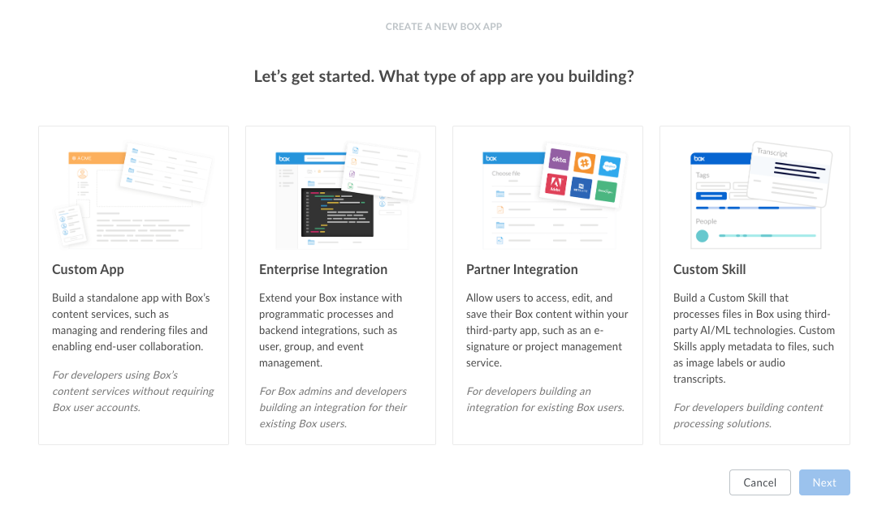
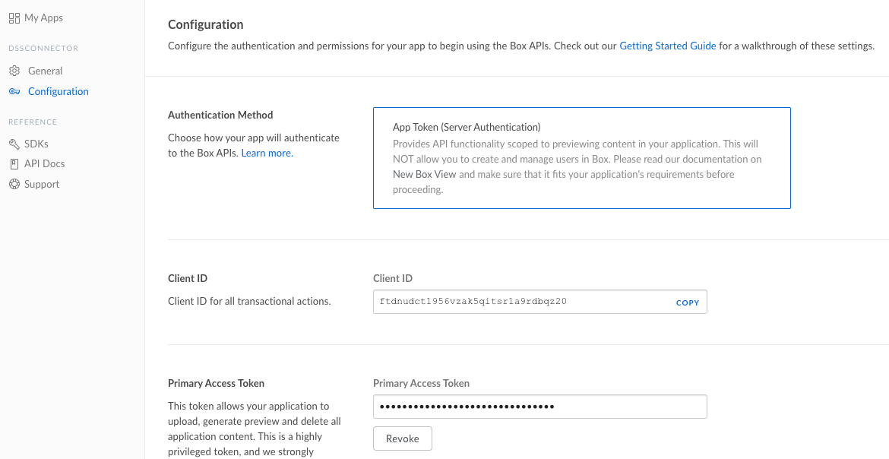
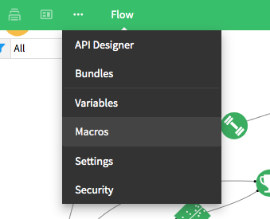
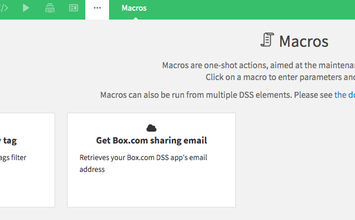
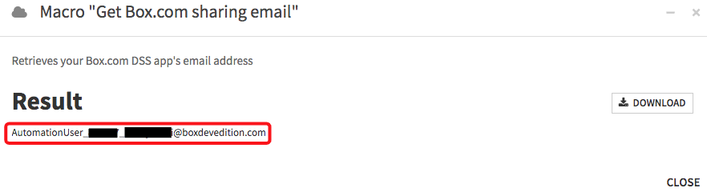
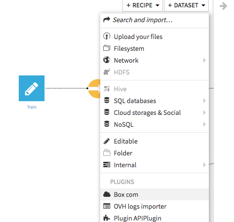
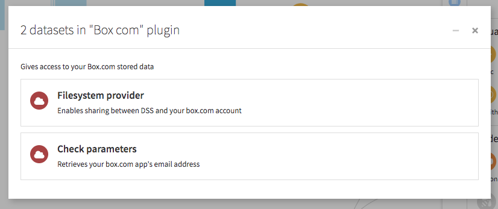
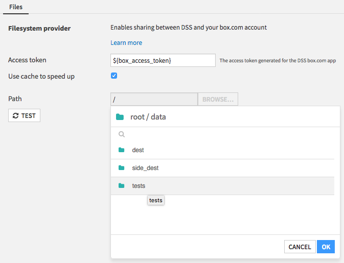

# Box.com Plugin
This plugin provides a read connector to interact in your Dataiku DSS projects with csv documents stored on [box.com](https://www.box.com).

## Install in DSS
To install **Plugin: Box.com** in DSS, go to *Administration > Plugins > Store* and search for the plugin name.

Alternatively, [Download it]() (for DSS 6+) and follow our [installation instructions](https://doc.dataiku.com/dss/latest/plugins/installing.html)

## Plugin information

|   |   |
|---|---|
| Version  | 1.0.0 |
| Author  | Dataiku |
| Released  | 2019-09 |
| Last updated  | 2019-09 |
| License  | Apache Software License |
| Source code  | [Github](https://github.com/dataiku/dataiku-contrib/tree/master/googlesheets) |
| Reporting issues  | [Github](https://github.com/dataiku/dataiku-contrib/issues) |

## How to use

You need to install the plugin in Dataiku DSS. Go to the *Administration > Plugins* page. The plugin requires the installation of a code environment.

Create a new dataset using the plugin. You have 3 parameters to fill. Click on the button **Test** & **Get schema** button. Then, **save** and **explore**.

In order to use the plugin, the administrator of the box.com account will have to create an box.com app: 

1. As administrator, go to your [box.com account page](https://app.box.com/account) and upgrade to developper.
2. From the administrator's [developers console](https://app.box.com/developers/console), create a new Partner Integration.

3. Name your app.
> People given access to this app will be able to access all files shared to it. Where access to dataset must be restricted to a given group, make and name a separate app for this purpose.
4. From the App general panel, copy the *User ID*.
5. From the App configuration panel, copy the *Client ID* and create and copy a secondary access token.


Once you have you User ID, Client ID and access token, you will be able to retrieve the app's sharing email address. To do so:
1. Inside a DSS project, go to the **Macros** menu



2. Select the **Get Box.com sharing email** macro

3. Fill in the connection credentials and press **Run Macro**
> To avoid filling in the connection details in every box.com dataset of your project, your can instead set them as project variables as :
```json
{
  "box_access_token": "1234abc...",
  "box_client_id": "5678def...",
  "box_user_id": "9876543210"
}
```
4. Copy the email address returned in the array.


To make files visible to DSS, you will need to share them from your box account with this email address.

Once this is done, you can create a new dataset using the box.com plugin. First, create the dataset by picking box.com in the dataset section :

Choose the Filesystem provider, and fill in the details copied from the app configuration panel.

From the connector's *Settings > Files* panel, you should now be able to browser your box directory and select the file or directory you want to access.

